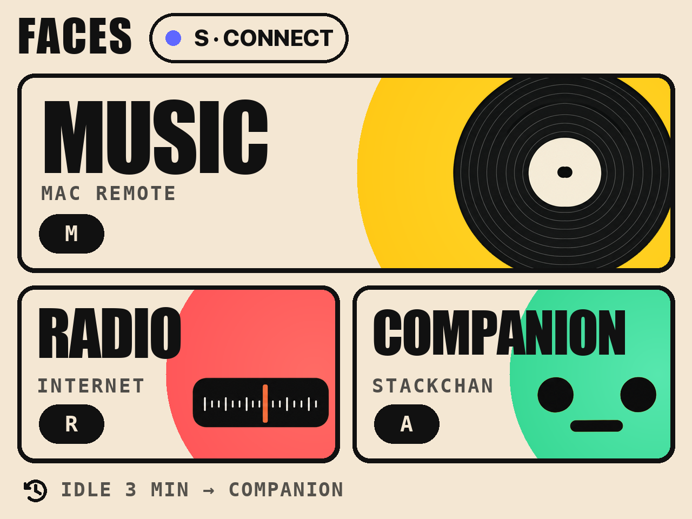
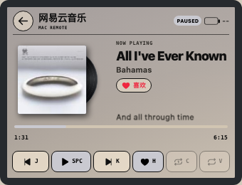
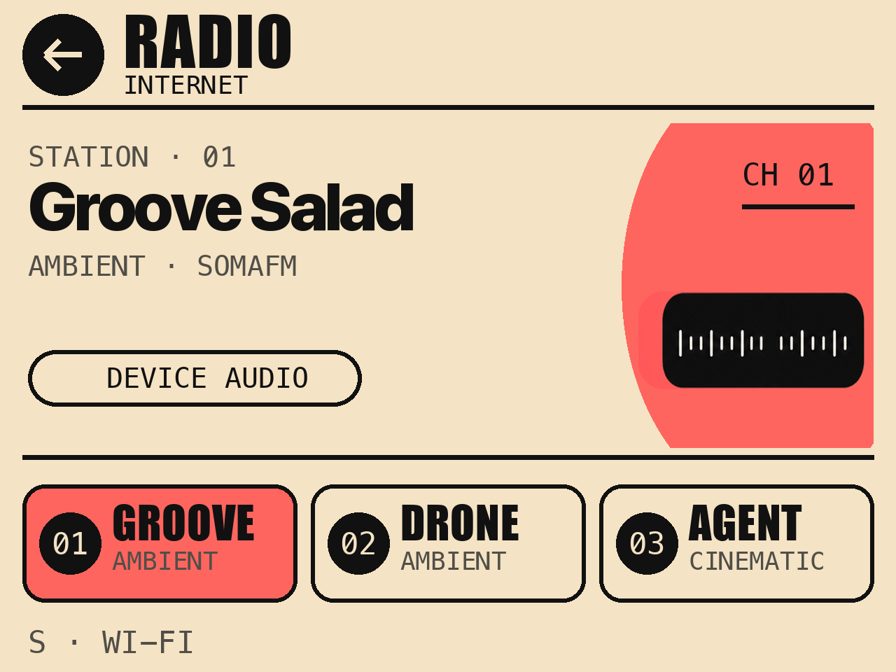
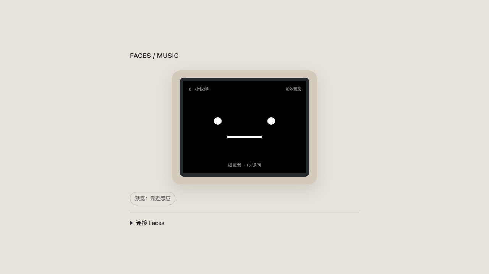

<p align="center">
  
</p>

<p align="center">
  <a href="#english">English</a> · <a href="#中文说明">中文</a>
</p>

## UI previews / 界面预览

| Music Remote / 音乐遥控器 | Internet Radio / 网络收音机 | Companion / 小伙伴 |
| --- | --- | --- |
|  |  |  |

<a id="english"></a>

# M5 Faces CoreS3 Suite

An ESP32-S3 firmware suite for an M5 Faces/CoreS3 stack with a Keyboard3 and
Bottom3. It brings a keyboard test, a Mac music remote, an internet-radio
player, and a small on-device companion into one project.

## Included

- `suite` firmware launches Music Remote (`M`), Radio (`R`), Companion (`A`),
  and Connection Center (`S`); press `SYM + 0` to return to the launcher.
- The optional Mac music bridge provides a pairing-token protected browser
  preview and supports Apple Music and NetEase Cloud Music metadata and
  playback actions. Audio stays on the Mac.
- CoreS3 touch, Keyboard3 indicators, battery and display-power UI, radio,
  OTA, companion logic, and regression tests are included.

## Features

- **Paper UI:** Home, Music and Radio share a native 320×240 paper layout.
  Cards use their visible bounds for touch, and a short press paints before it
  opens the selected app.
- **Launcher:** three cards for Music Remote, Internet Radio and Companion.
  It has persistent power status and opens Companion after three minutes without
  input.
- **Connection Center:** a shared Wi-Fi and Bridge setup flow for Music Remote,
  Internet Radio, and OTA. It can retain two network profiles, choose one
  automatically or manually, and opens a temporary, password-protected setup
  hotspot when editing is needed.
- **Music Remote:** Apple Music and NetEase Cloud Music metadata, album colour,
  artwork, playback state, progress, favourite status and synchronised lyrics
  when a match is available. The UI preserves the last complete artwork/theme
  while new media is decoding. It controls the Mac; it does not stream or decode
  audio itself.
- **Internet Radio:** the device connects to Wi-Fi and plays the built-in radio
  stations through its own speaker. The browser page is a visual preview only.
- **Companion:** an on-device animated face with touch, motion, proximity, and
  camera-motion responses. The browser preview demonstrates the visual behavior
  without using device sensors.
- **Power and status:** Home, Music and Radio retain battery/USB status. A short
  press of the power key dims or wakes the display without stopping app tasks.

## Interaction

| Context | Keyboard | Touch / device behavior |
| --- | --- | --- |
| Home | `S` Connection Center, `M` Music, `R` Radio, `A` Companion | Tap a card to enter its app, or tap the `S Connection` header. |
| All apps | `SYM + 0` / `ESC` returns home | Use the visible home/back target. |
| Connection Center | `A` automatic, `H` home, `W` work, `E` edit, `Q` / `ESC` home | Pick a saved network or open the temporary setup hotspot. |
| Music | `J` previous, `Space` play/pause, `K` next, `H` favourite, `C` repeat one, `V` repeat all; `S` Connection Center | Tap the corresponding controls. |
| Radio | `Q` / `ESC` home, `S` Connection Center, `Space` play/pause, `J` / `K` tune, `1`–`3` select a station, `+` / `-` volume | Select a station, use `DEVICE AUDIO` to play/pause, or use the Wi-Fi target. Playback is local to the hardware. |
| Companion | `Q` or `ESC` returns home | Touch the face; movement and proximity affect its reactions on supported hardware. |

## Build and run

Install PlatformIO and the toolchain declared in `platformio.ini`, then build
the combined firmware:

```sh
pio run -e suite
```

The standalone keyboard test and individual apps remain available through
environments including `cores3`, `controller`, and `radio`.

The Bridge is optional and never opens a USB serial port:

```sh
./tools/build_music_helper.sh
./tools/start_music.command
```

Open the displayed localhost URL for the preview. For a paired device on a
trusted LAN, restart with `./tools/start_music.command --lan`, then enter the
Bridge address, port, and pairing token through Connection Center. When LAN
mode is enabled, a paired device can also discover the Bridge automatically;
the saved address remains a fallback.

To publish an OTA candidate, provide the MAC address of the device you control
at publish time. The address is stored only in ignored local OTA metadata and
remains bound to the firmware manifest:

```sh
python3 tools/publish_ota.py --device-mac aa:bb:cc:dd:ee:ff
```

## Privacy and safety

This repository contains no flash backups, firmware images, serial captures,
test receipts, pairing tokens, Wi-Fi credentials, hardware identifiers, USB
port names, or host-specific launch configuration. The bridge generates its
token in ignored `.local/music.json` on first launch and binds to localhost by
default. Use LAN mode only on a trusted network.

Use an explicitly identified serial port for uploads. This project deliberately
does not ship a device-specific flashing script or a prebuilt image: inspect
the target, partition layout, and your own backup/recovery plan before writing
flash.

## Test

Run the Python bridge suite with:

```sh
python3 -m unittest discover -s tests -p 'test_*.py'
```

Several C++ model tests are standalone C++17/sanitizer tests. A successful
firmware build is also an important integration check.

## Third-party material

`third_party/stackchan/` records attribution for the StackChan-derived
companion geometry under its MIT license. The embedded Noto Sans CJK SC assets
remain under the SIL Open Font License; see `assets/fonts/OFL.txt`.

---

<a id="中文说明"></a>

# M5 Faces CoreS3 套件

这是面向 M5 Faces/CoreS3、Keyboard3 与 Bottom3 的 ESP32-S3 固件套件：将键盘
测试、Mac 音乐遥控器、网络收音机和屏幕小伙伴整合到同一工程中。

## 包含内容

- `suite` 整合固件：按 `S` 进入连接中心、`M` 进入音乐遥控器、`R` 进入收音机、
  `A` 进入小伙伴；`SYM + 0` 返回主菜单。
- 可选的 Mac 音乐桥接：提供带配对令牌保护的浏览器预览，可读取并控制 Apple
  Music 与网易云音乐；声音始终由 Mac 播放。
- 包括 CoreS3 触控、Keyboard3 指示灯、电池与息屏 UI、收音机、OTA、小伙伴逻辑
  以及回归测试。

## 功能概览

- **纸面 UI：** 首页、音乐与收音机共用原生 320×240 的纸面排版。卡片的可点区域
  与可见边界一致，轻点会先显示按下反馈再进入应用。
- **主菜单：** 三张卡片分别进入音乐遥控器、网络收音机和小伙伴；常驻电量状态，连续
  三分钟没有输入时自动进入小伙伴。
- **连接中心：** 音乐遥控器、网络收音机与 OTA 共用的 Wi-Fi 和 Bridge 配置入口。
  可保存两套网络、自动或手动选择；需要修改时，会开启带临时随机密码的配网热点。
- **音乐遥控器：** 显示 Apple Music 与网易云音乐来源、封面色彩、播放状态、进度、
  喜欢状态和可匹配的同步歌词。新媒体尚未解码完成时会保留上一张完整封面与主题，
  避免闪成空白；它控制 Mac 播放，不在设备端串流或解码音频。
- **网络收音机：** 设备自行连接 Wi-Fi，并通过自身扬声器播放内置电台；浏览器页面只
  用于界面预览，不会在 Mac 播放电台。
- **小伙伴：** 设备端动态小脸支持触摸、运动、接近和摄像头运动响应；浏览器只演示
  视觉效果，不会读取设备传感器。
- **电源与状态：** 首页、音乐与收音机均显示电池/USB 状态；短按电源键可息屏或唤醒，
  App 的后台任务不会因此停止。

## 交互方式

| 场景 | 键盘 | 触屏 / 设备交互 |
| --- | --- | --- |
| 主菜单 | `S` 连接中心、`M` 音乐、`R` 收音机、`A` 小伙伴 | 点击对应卡片进入，或点击顶部的 `S 连接`。 |
| 所有 App | `SYM + 0` / `ESC` 返回主菜单 | 点击页面中可见的返回/主菜单区域。 |
| 连接中心 | `A` 自动、`H` 家庭、`W` 公司、`E` 编辑、`Q` / `ESC` 返回 | 选择已保存网络，或开启临时配网热点。 |
| 音乐遥控器 | `J` 上一首、`空格` 播放/暂停、`K` 下一首、`H` 喜欢、`C` 单曲循环、`V` 列表循环；`S` 连接中心 | 点击对应控件。 |
| 网络收音机 | `Q` / `ESC` 返回主菜单、`S` 连接中心、`空格` 播放/暂停、`J` / `K` 切台、`1`–`3` 直选、`+` / `-` 音量 | 选择电台，点击 `DEVICE AUDIO` 播放/暂停，或点击 Wi-Fi 区域进入连接中心；声音由硬件本地播放。 |
| 小伙伴 | `Q` 或 `ESC` 返回主菜单 | 触摸小脸；支持的硬件会根据运动和接近状态作出反应。 |

## 构建与运行

安装 PlatformIO 及 `platformio.ini` 中声明的工具链后，构建整合固件：

```sh
pio run -e suite
```

独立键盘测试和各单独 App 仍可通过 `cores3`、`controller`、`radio` 等环境构建。

音乐桥接是可选的，且不会打开 USB 串口：

```sh
./tools/build_music_helper.sh
./tools/start_music.command
```

在浏览器打开终端显示的 localhost 地址即可预览。若要让已配对的设备通过受信任
局域网连接，请用 `./tools/start_music.command --lan` 重启服务，再在连接中心填写
Bridge 地址、端口和配对令牌。开启 LAN 模式后，已配对设备也可自动发现 Bridge；
手填地址仍会保留为后备方式。

发布 OTA 候选包时，需要显式传入你所控制设备的 MAC 地址；该地址只保存在被
Git 忽略的本地 OTA 元数据里，并与固件清单绑定：

```sh
python3 tools/publish_ota.py --device-mac aa:bb:cc:dd:ee:ff
```

## 隐私与安全

公开仓库不包含整片 Flash 备份、固件镜像、串口记录、测试回执、配对令牌、Wi-Fi
凭据、硬件标识、USB 端口名或主机专属启动配置。Bridge 首次启动时会在被忽略的
`.local/music.json` 中生成令牌，默认只监听 localhost；只应在可信网络中开启 LAN
模式。

上传前请明确确认目标串口。项目特意不提供绑定具体设备的刷写脚本或预编译镜像；
写入 Flash 前，请自行核对设备、分区布局与备份/恢复方案。

## 测试

运行 Python Bridge 回归测试：

```sh
python3 -m unittest discover -s tests -p 'test_*.py'
```

部分 C++ 状态模型测试可独立以 C++17 与 sanitizers 运行；成功构建固件也是重要的
集成验证。

## 第三方内容

`third_party/stackchan/` 记录了 StackChan 小伙伴几何实现的 MIT 许可归属。嵌入的
Noto Sans CJK SC 字体资产继续采用 SIL Open Font License，见
`assets/fonts/OFL.txt`。

## License

MIT © 2026 Machiwhale Studio. See [LICENSE](LICENSE).

Made with GPT-6 Astra by Machiwhale Studio.
